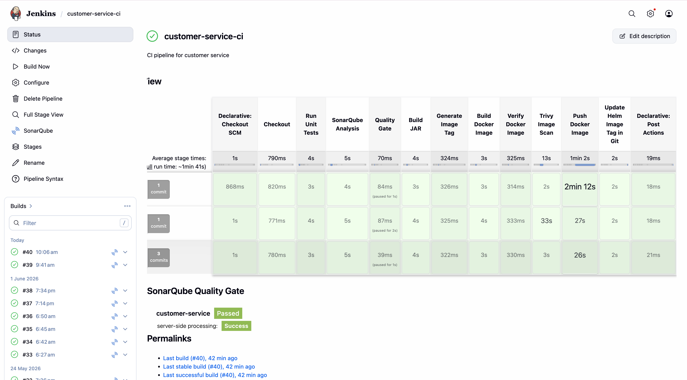
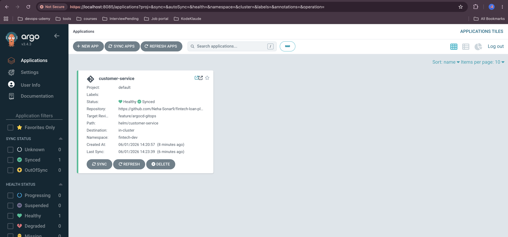
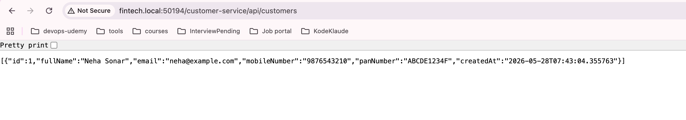
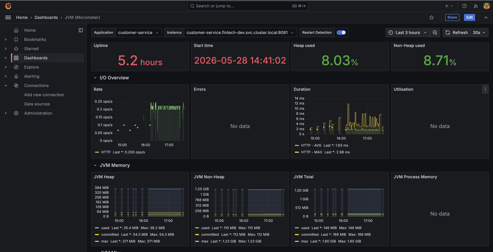
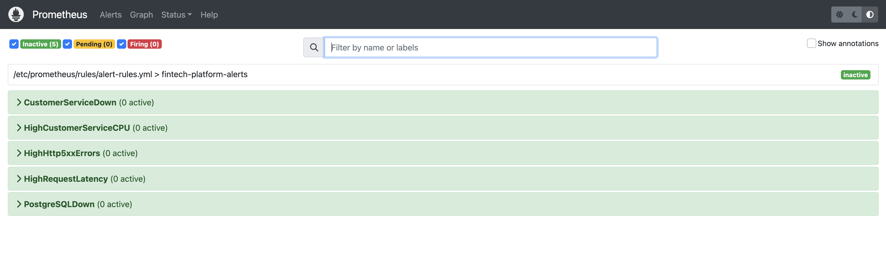
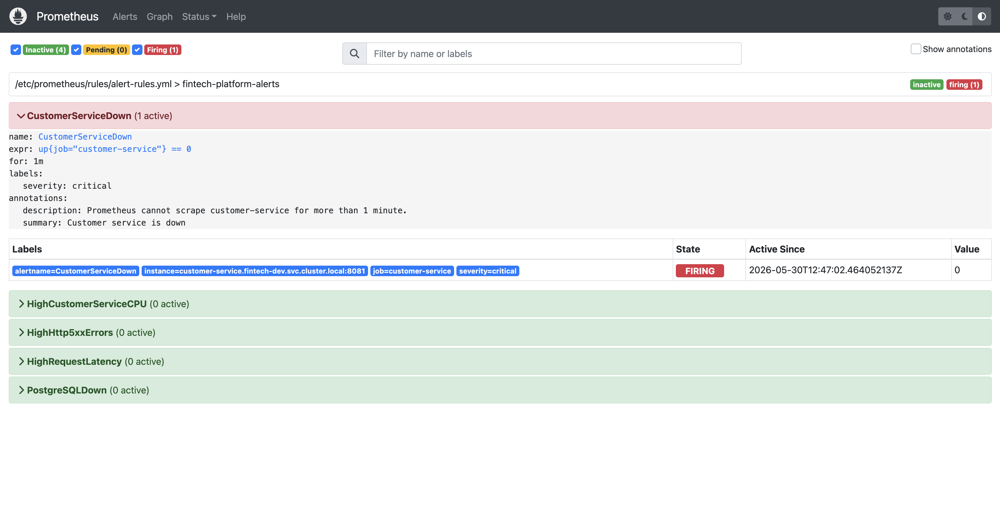
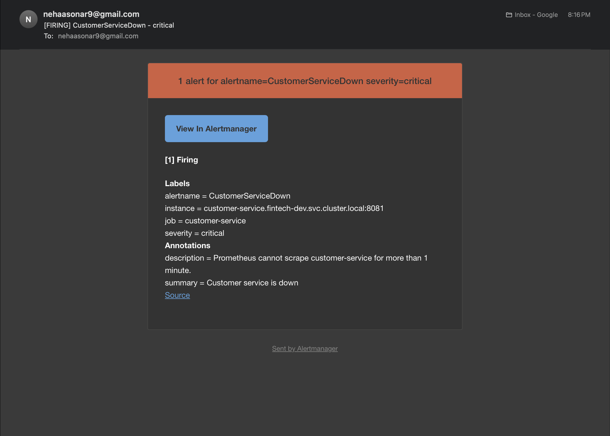
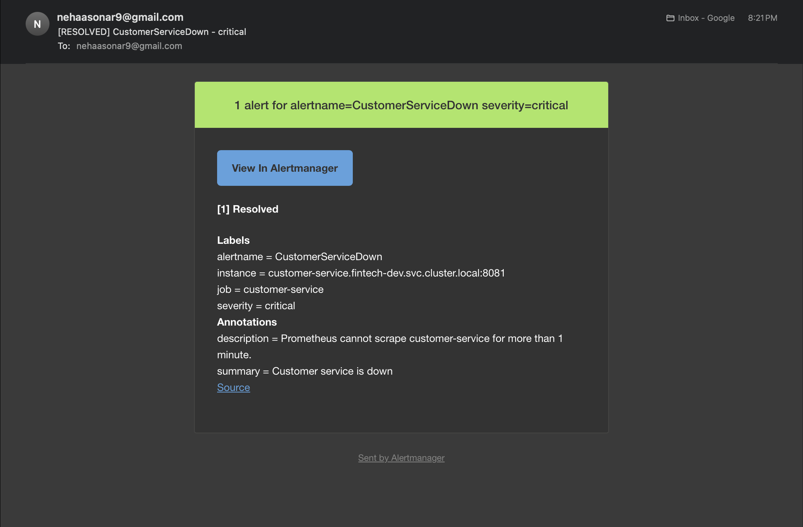

# 🏦 Fintech Loan Platform

A production-style cloud-native fintech microservices platform built using **Spring Boot, PostgreSQL, Docker, Kubernetes, Helm, Jenkins, SonarQube, Trivy, Prometheus, Grafana, Alertmanager, and ArgoCD GitOps**.


The goal of this project is not just to run an application locally, but to simulate how modern software is built, secured, deployed, monitored, and operated in real-world environments.

---

## 🚀 Project Highlights

✅ Spring Boot Microservice

✅ PostgreSQL Database

✅ Docker Containerization

✅ Kubernetes Deployment (Minikube)

✅ Helm Packaging & Release Management

✅ Jenkins CI Pipeline

✅ SonarQube Code Quality Analysis

✅ Trivy Container Security Scanning

✅ DockerHub Image Registry

✅ Prometheus Metrics Collection

✅ Grafana Dashboards

✅ Alertmanager Email Notifications

✅ ArgoCD GitOps Continuous Delivery

✅ Multi-Branch Git Workflow

---
## 📌 Current Project Scope

Currently Implemented:

✅ Customer Service

Planned Services:

🚧 Loan Service

🚧 Authentication Service

🚧 Notification Service

---
# 🏗️ Architecture

```text
Developer
    │
    ▼
GitHub Repository
    │
    ▼
Jenkins CI Pipeline
    │
    ├── Maven Build
    ├── Unit Tests
    ├── SonarQube Analysis
    ├── Quality Gate
    ├── Docker Build
    ├── Trivy Security Scan
    └── DockerHub Push
    │
    ▼
Update Helm values.yaml
    │
    ▼
GitHub (Source of Truth)
    │
    ▼
ArgoCD GitOps
    │
    ▼
Kubernetes Cluster
    │
    ▼
Customer Service Pods
    │
    ▼
PostgreSQL
```

---

# 📦 Current Microservice

### Customer Service

Responsible for managing customer records.

Features:

- Create Customer
- Get Customer
- Update Customer
- Delete Customer
- PostgreSQL Persistence
- Micrometer Metrics
- Prometheus Monitoring

---

# 🛠️ Technology Stack

| Category | Technology |
|-----------|------------|
| Language | Java 17 |
| Framework | Spring Boot |
| Database | PostgreSQL |
| Build Tool | Maven |
| Containerization | Docker |
| Container Registry | DockerHub |
| Orchestration | Kubernetes |
| Package Manager | Helm |
| CI | Jenkins |
| Code Quality | SonarQube |
| Security Scanning | Trivy |
| Monitoring | Prometheus |
| Visualization | Grafana |
| Alerting | Alertmanager |
| GitOps | ArgoCD |
| Version Control | Git & GitHub |

---

# 🌳 Git Branching Strategy

This repository follows a production-style branching workflow.

| Branch | Purpose |
|----------|----------|
| main | Stable production-ready code |
| develop | Integration branch |
| feature/jenkins-ci-customer-service | Jenkins CI implementation |
| feature/dockerhub-image-push | DockerHub image publishing |
| feature/harden-dockerfile | Docker image optimization |
| feature/add-trivy-image-scan | Container security scanning |
| feature/helm-migration | Helm deployment migration |
| feature/argocd-gitops | GitOps implementation |
| feature/fix-jenkins-trivy-tag | CI/CD fixes |

Development Flow:

```text
Feature Branch
      ↓
Pull Request
      ↓
Develop Branch
      ↓
Main Branch
```

---

# 🔄 CI/CD Workflow

## Continuous Integration (Jenkins)

Every code change triggers:

```text
Checkout Source Code
        ↓
Run Unit Tests
        ↓
SonarQube Analysis
        ↓
Quality Gate Validation
        ↓
Build JAR
        ↓
Build Docker Image
        ↓
Verify Docker Image
        ↓
Trivy Vulnerability Scan
        ↓
Push Image To DockerHub
        ↓
Update Helm Image Tag
        ↓
Commit Changes To GitHub
```

---

## Runtime traffic flow
```text
Client
   │
   ▼
Ingress
(fintech.local)
   │
   ▼
Customer Service
(Spring Boot)
   │
   ▼
PostgreSQL
```

---

## Continuous Delivery (ArgoCD GitOps)

ArgoCD continuously watches the Git repository.

Whenever Jenkins updates:

```yaml
helm/customer-service/values.yaml
```

with a new image tag:

```yaml
image:
  repository: nsonar/customer-service
  tag: 40-3616086
```

ArgoCD automatically detects the Git change and synchronizes Kubernetes.

This makes GitHub the **single source of truth**.

---

# ☸️ Kubernetes Deployment

Deployed using Helm charts.

Resources currently managed:

- Namespace
- Deployment
- Service
- ConfigMap
- Secret
- StatefulSet (PostgreSQL)
- Persistent Volume Claim

Namespace:

```bash
fintech-dev
```

---

# 🐘 PostgreSQL

PostgreSQL is deployed inside Kubernetes using a StatefulSet.

Used for:

- Customer records
- Persistent storage
- Backend service data

Persistence:

```text
PostgreSQL
    ↓
Persistent Volume Claim
    ↓
Persistent Storage
```

---

# 📊 Monitoring Stack

### Prometheus

Collects:

- JVM Metrics
- Application Metrics
- HTTP Metrics
- Kubernetes Metrics

### Grafana

Visualizes:

- CPU Usage
- Memory Usage
- JVM Heap
- Request Rate
- Request Latency
- Thread Statistics
- File Descriptors

---

# 🚨 Alerting

Alertmanager sends email notifications for:

### Customer Service Down

```yaml
up{job="customer-service"} == 0
```

### PostgreSQL Down

### High CPU Usage

### High HTTP 5xx Errors

### High Request Latency

Email alerts are automatically sent when:

- Alert fires
- Alert resolves

---

# 📸 Screenshots

## Jenkins CI Pipeline



Shows:

- SonarQube
- Trivy
- Docker Build
- DockerHub Push
- GitOps Update

---

## ArgoCD GitOps Dashboard



Shows:

- Healthy
- Synced
- Git → Kubernetes Synchronization

---

## Customer Service API



---

## Grafana Dashboard



---

## Prometheus Alerts



---

## Alertmanager Email Notifications







---

# 🌐 Access URLs

| Component | URL |
|------------|------|
| Customer Service API | http://fintech.local:50194/customer-service/api/customers |
| Jenkins | http://localhost:8080 |
| SonarQube | http://localhost:9000 |
| Grafana | http://localhost:3000 |
| Prometheus | http://localhost:9090 |
| Alertmanager | http://localhost:9093 |
| ArgoCD | https://localhost:8085 |

> Port values may vary depending on the local environment.

---

# 🔍 Validation Commands

### Verify Customer Service

```bash
curl http://fintech.local:50194/customer-service/api/customers
```

### Verify Pods

```bash
kubectl get pods -n fintech-dev
```

### Verify Services

```bash
kubectl get svc -n fintech-dev
```

### Verify Helm Release

```bash
helm list -n fintech-dev
```

### Verify ArgoCD Sync

```bash
kubectl get applications -n argocd
```

### Verify Running Image

```bash
kubectl describe pod POD_NAME -n fintech-dev | grep Image
```

---

# 📁 Repository Structure

```text
fintech-loan-platform
│
├── customer-service
│   ├── src
│   ├── pom.xml
│   └── Dockerfile
│
├── helm
│   └── customer-service
│
├── jenkins
│   ├── Jenkinsfile
│   ├── Dockerfile.agent
│   └── docker-compose.jenkins.yml
│
├── monitoring
│   ├── prometheus
│   ├── grafana
│   └── alertmanager
│
├── argocd
│   └── customer-service-application.yaml
│
└── README.md
```

---

# ⭐ What Makes This Project Different

Many tutorials stop once an application runs locally.

This project focuses on the complete software delivery lifecycle:

- Application Development
- Containerization
- Security Scanning
- CI/CD Automation
- Kubernetes Deployment
- Helm Release Management
- Monitoring & Observability
- Alerting & Incident Detection
- GitOps Continuous Delivery

The objective is to simulate how modern cloud-native applications are delivered and operated in real production environments.

---

# 🚀 Future Improvements

- Add Loan Service
- Add Authentication Service
- Add Notification Service
- API Gateway Integration
- Ingress + HTTPS/TLS
- AWS EKS Deployment
- Terraform Infrastructure Provisioning
- HashiCorp Vault Integration
- External Secrets Operator
- Argo Rollouts (Canary Deployments)
- Blue-Green Deployments
- Centralized Logging (ELK/OpenSearch)
- Distributed Tracing (Jaeger/OpenTelemetry)
- Service Mesh (Istio)
- Multi-Environment GitOps (Dev/UAT/Prod)

---

# 👩‍💻 Author

**Neha Sonar**

DevOps Engineer | Kubernetes | AWS | Jenkins | Helm | GitOps | Observability

## connect
https://github.com/Neha-Sonar9
https://www.linkedin.com/in/neha-sonar-09j01/